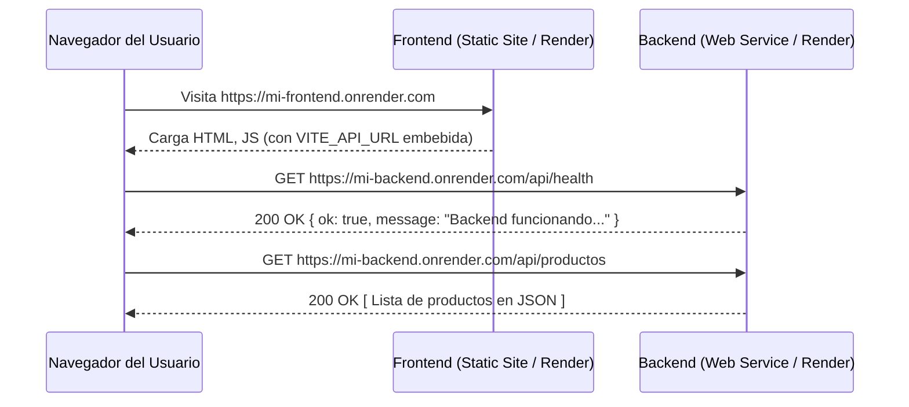

# 🚀 Proyecto Full-Stack: React + Node.js (Listo para Despliegue en Render)

Este repositorio contiene una aplicación web completa con arquitectura desacoplada (**Frontend** y **Backend** independientes) dentro de un único repositorio de GitHub (Monorepo), preparada y optimizada específicamente para desplegarse como dos servicios separados en **[Render](https://render.com/)**:

- **Frontend:** Desplegado como **Static Site** (React + Vite).
- **Backend:** Desplegado como **Web Service** (Node.js + Express).

---

## 📁 Estructura del Proyecto

```text
reder/
├── frontend/                     # Aplicación de Cliente (React + Vite)
│   ├── public/                   # Recursos estáticos (favicon, iconos)
│   ├── src/
│   │   ├── components/           # Componentes UI (Navbar, HealthStatus, ProductList, ProductCard)
│   │   ├── services/             # Servicio API centralizado (api.js con VITE_API_URL)
│   │   ├── App.jsx               # Componente principal con consumo de endpoints
│   │   ├── App.css               # Estilos del dashboard y catálogo
│   │   ├── index.css             # Tokens de diseño, tema oscuro y glassmorphism
│   │   └── main.jsx              # Punto de entrada de React
│   ├── index.html                # Plantilla HTML5 con fuentes Google Fonts
│   ├── vite.config.js            # Configuración de Vite y directorio dist
│   ├── package.json              # Dependencias y scripts de frontend
│   └── .env.example              # Plantilla de variables de entorno para Vite
│
├── backend/                      # Servidor API REST (Node.js + Express)
│   ├── controllers/              # Controladores (health.controller.js, productos.controller.js)
│   ├── routes/                   # Enrutamiento modular (health.routes.js, productos.routes.js)
│   ├── server.js                 # Servidor Express, CORS y puerto dinámico
│   ├── package.json              # Dependencias y scripts de backend
│   └── .env.example              # Plantilla de variables de entorno de Node
│
├── .gitignore                    # Reglas globales de exclusión (node_modules, .env, dist)
└── README.md                     # Guía completa de uso y despliegue
```

---

## 🛠️ Tecnologías Utilizadas

- **Frontend:** React 18, Vite, JavaScript moderno, CSS3 Vanilla con Glassmorphism y temas oscuros, API Fetch nativa.
- **Backend:** Node.js, Express, CORS, Dotenv, API REST modular con soporte para `node --watch`.

---

## 📖 Guía Paso a Paso

### 1. Cómo instalar el proyecto

Clona el repositorio o sitúate en la carpeta raíz del proyecto. Como el frontend y el backend están desacoplados, debes instalar las dependencias de cada carpeta por separado:

#### A) Instalar dependencias del Backend:
```bash
cd backend
npm install
cd ..
```

#### B) Instalar dependencias del Frontend:
```bash
cd frontend
npm install
cd ..
```

---

### 2. Cómo ejecutar frontend localmente

1. Ve a la carpeta `frontend`:
   ```bash
   cd frontend
   ```
2. Asegúrate de tener tu archivo `.env` configurado:
   - Copia `.env.example` a `.env` (si aún no existe):
     ```bash
     cp .env.example .env
     ```
   - Contenido de `frontend/.env`:
     ```env
     VITE_API_URL=http://localhost:3000
     ```
3. Inicia el servidor de desarrollo de Vite:
   ```bash
   npm run dev
   ```
4. Abre tu navegador en la URL indicada (habitualmente `http://localhost:5173`).

---

### 3. Cómo ejecutar backend localmente

1. En una nueva terminal, ve a la carpeta `backend`:
   ```bash
   cd backend
   ```
2. Asegúrate de tener tu archivo `.env` configurado:
   - Copia `.env.example` a `.env` (si aún no existe):
     ```bash
     cp .env.example .env
     ```
   - Contenido de `backend/.env`:
     ```env
     PORT=3000
     CLIENT_URL=http://localhost:5173
     NODE_ENV=development
     ```
3. Ejecuta el servidor en modo desarrollo con recarga automática:
   ```bash
   npm run dev
   ```
   *(También puedes usar `npm start` para ejecutar `node server.js` normal).*
4. Verifica que responda en tu navegador o terminal:
   - `http://localhost:3000/`
   - `http://localhost:3000/api/health`
   - `http://localhost:3000/api/productos`

---

### 4. Cómo subirlo a GitHub

Para que Render pueda desplegar tu proyecto, primero debes publicarlo en tu repositorio de GitHub:

1. **Inicializar Git en la raíz:**
   ```bash
   git init
   ```
2. **Revisar que `.gitignore` esté activo:**
   Asegúrate de que los archivos `.env` reales y las carpetas `node_modules` y `dist` NO se incluyan en el commit.
   ```bash
   git status
   ```
3. **Crear el primer commit:**
   ```bash
   git add .
   git commit -m "feat: proyecto full-stack desacoplado para Render"
   ```
4. **Vincular tu repositorio remoto y subirlo:**
   - Crea un nuevo repositorio vacío en [GitHub](https://github.com/new).
   - Ejecuta:
     ```bash
     git branch -M main
     git remote add origin https://github.com/TU-USUARIO/TU-REPOSITORIO.git
     git push -u origin main
     ```

---

### 5. Cómo desplegar el Backend en Render

El backend debe desplegarse **primero** para obtener su URL pública (`https://tu-backend.onrender.com`), la cual necesitarás en el frontend.

1. Inicia sesión en [Render Dashboard](https://dashboard.render.com/).
2. Haz clic en el botón **New +** y selecciona **Web Service**.
3. Conecta tu repositorio de GitHub.
4. Configura los siguientes campos:
   - **Name:** `mi-backend-api` (o el nombre que elijas)
   - **Region:** Selecciona la más cercana a tu público (por ejemplo, *Oregon (US West)* o *Frankfurt (EU Central)*)
   - **Branch:** `main`
   - **Root Directory:** `backend` *(¡Muy importante! Indica la subcarpeta)*
   - **Runtime:** `Node`
   - **Build Command:** `npm install`
   - **Start Command:** `npm start`
   - **Instance Type:** `Free`
5. *(Opcional)* En la sección **Environment Variables**:
   - `NODE_ENV`: `production`
   - `CLIENT_URL`: `https://tu-frontend.onrender.com` (puedes actualizarlo después de crear el frontend).
   *(Nota: Render asigna automáticamente la variable `PORT`, por lo que el código usa obligatoriamente `process.env.PORT || 3000`).*
6. Haz clic en **Create Web Service**.
7. Espera a que termine el despliegue y copia la URL generada por Render (ejemplo: `https://mi-backend-api.onrender.com`).

---

### 6. Cómo desplegar el Frontend en Render

1. En el [Render Dashboard](https://dashboard.render.com/), haz clic en **New +** y selecciona **Static Site**.
2. Conecta el **mismo repositorio** de GitHub.
3. Configura los siguientes campos:
   - **Name:** `mi-frontend-app`
   - **Branch:** `main`
   - **Root Directory:** `frontend` *(¡Muy importante!)*
   - **Build Command:** `npm install && npm run build`
   - **Publish Directory:** `dist`
4. En la sección **Environment Variables**, añade:
   - **Key:** `VITE_API_URL`
   - **Value:** `https://mi-backend-api.onrender.com` *(Pega la URL de tu backend de Render SIN barra diagonal al final)*
5. Haz clic en **Create Static Site**.
6. Render instalará las dependencias, compilará la aplicación con Vite y publicará los archivos estáticos de la carpeta `dist`.

---

### 7. Qué poner exactamente en Root Directory

Render utiliza el campo **Root Directory** para saber en qué subcarpeta debe ejecutar los comandos dentro de un monorepositorio:

| Servicio en Render | Valor exacto de **Root Directory** |
| :--- | :--- |
| **Backend (Web Service)** | `backend` |
| **Frontend (Static Site)** | `frontend` |

> ⚠️ **Atención:** No coloques `./backend` ni `/backend/`. Escribe simplemente `backend` o `frontend`.

---

### 8. Qué poner en Build Command

El **Build Command** es la instrucción que se ejecuta durante la fase de preparación o compilación:

| Servicio en Render | Valor exacto de **Build Command** | Explicación |
| :--- | :--- | :--- |
| **Backend (Web Service)** | `npm install` | Instala `express`, `cors` y `dotenv`. No requiere compilación. |
| **Frontend (Static Site)** | `npm install && npm run build` | Instala dependencias y ejecuta Vite para generar la carpeta optimizada `dist`. |

---

### 9. Qué poner en Start Command

El **Start Command** es el comando que mantiene viva la aplicación en ejecución:

| Servicio en Render | Valor exacto de **Start Command** | Explicación |
| :--- | :--- | :--- |
| **Backend (Web Service)** | `npm start` | Ejecuta el script de producción `node server.js`. |
| **Frontend (Static Site)** | *(No aplica / No existe)* | Al ser un sitio estático, Render lo sirve automáticamente mediante CDN. |

---

### 10. Qué poner en Publish Directory

El **Publish Directory** le indica a Render qué carpeta contiene el HTML, CSS y JS ya compilados listos para servir:

| Servicio en Render | Valor exacto de **Publish Directory** |
| :--- | :--- |
| **Frontend (Static Site)** | `dist` |
| **Backend (Web Service)** | *(No aplica)* |

---

### 11. Cómo crear `VITE_API_URL` en Render

Dado que Vite compila las variables de entorno en tiempo de construcción (**build time**), `VITE_API_URL` debe estar presente antes de ejecutar `npm run build`:

1. Ingresa a tu **Static Site** en Render.
2. En el menú lateral izquierdo, haz clic en **Environment**.
3. Haz clic en **Add Environment Variable**.
4. En **Key** coloca:
   ```text
   VITE_API_URL
   ```
5. En **Value** coloca la URL HTTPS de tu backend en Render:
   ```text
   https://tu-backend-servicio.onrender.com
   ```
   *(Asegúrate de NO incluir una barra `/` al final).*
6. Guarda los cambios. Render disparará automáticamente un nuevo despliegue (*Deploy*) para incrustar la nueva variable en la compilación.

---

### 12. Cómo conectar Frontend y Backend

El flujo de conexión funciona así:



1. **Frontend:** Lee la variable `import.meta.env.VITE_API_URL` a través del servicio [`frontend/src/services/api.js`](file:///frontend/src/services/api.js).
2. **Backend:** Recibe la petición HTTP y evalúa la política CORS configurada en [`backend/server.js`](file:///backend/server.js).
3. **CORS:** El backend permite automáticamente peticiones provenientes de subdominios `*.onrender.com` y de la URL definida en `CLIENT_URL`.

---

### 13. Cómo revisar los Logs de Render si ocurre un error

Si algo falla (por ejemplo, el backend no inicia o el frontend no muestra datos):

1. **Revisar Logs del Backend:**
   - En el Dashboard de Render, entra a tu **Web Service**.
   - Haz clic en la pestaña **Logs** en la barra lateral.
   - Observa los mensajes de consola. Si el servicio inició correctamente verás:
     ```text
     ===========================================
      Servidor Backend iniciado con éxito
      Puerto: 10000
      Modo: production
      Health check: http://localhost:10000/api/health
     ===========================================
     ```
   - Si hubo un error (como dependencias no encontradas o error de sintaxis), aparecerá la traza completa de error en rojo.

2. **Revisar Logs de Compilación del Frontend:**
   - En tu **Static Site**, entra a la pestaña **Events** o **Deploys**.
   - Selecciona el despliegue activo. Verás la salida del comando `npm run build`.
   - Si falta alguna variable o hay un fallo de importación de React/Vite, Render mostrará el mensaje exacto aquí.

3. **Revisar la Consola del Navegador:**
   - Abre tu frontend en el navegador.
   - Presiona `F12` y ve a la pestaña **Console** y **Network**.
   - Si ves un error de CORS o conexión rechazada (`ERR_CONNECTION_REFUSED`), verifica que:
     - El backend esté activo (recuerda que el plan gratuito de Render suspende los servicios tras 15 minutos de inactividad; la primera petición puede tardar 30-50 segundos en responder).
     - La variable `VITE_API_URL` esté escrita con `https://` y coincida con el dominio del backend.

---

## 🧪 Pruebas Locales Rápidas

Para probar ambos servicios a la vez en tu computadora:

1. **Terminal 1 (Backend):**
   ```bash
   cd backend
   npm run dev
   ```
2. **Terminal 2 (Frontend):**
   ```bash
   cd frontend
   npm run dev
   ```
3. Visita `http://localhost:5173` y verás el semáforo verde de conexión activa y el catálogo de productos cargado en tiempo real.
# RENDER

